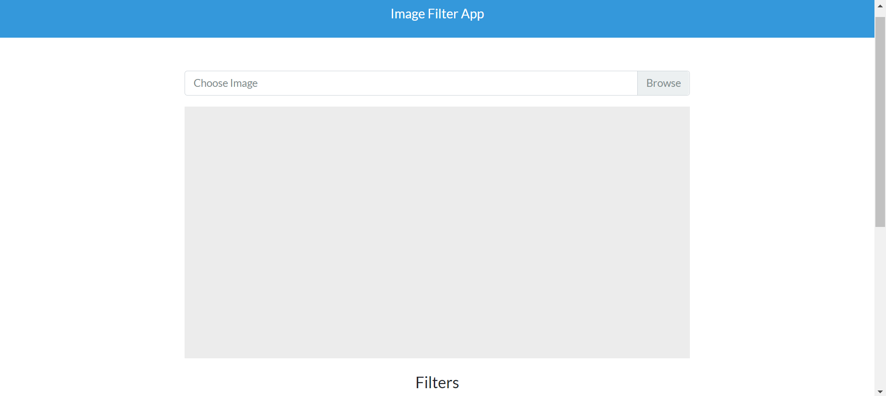

# PixelForge ⬡

**A professional-grade, browser-based image editing studio with real-time filters, AI-powered effects, and batch processing — all running entirely client-side.**



## 🌐 Live Demo

👉 **[Try PixelForge Now](https://sarthakraghuwanshi13-lang.github.io/Image-editor_app/)** — no install needed!

You can also install it as a desktop/mobile app from the browser (PWA supported).

---

## ✨ Features

### 🎛️ Adjustment Controls
- **Brightness, Contrast, Saturation, Vibrance** — fine-tune with real-time sliders
- **Hue Rotate, Temperature, Tint** — shift colors creatively
- **Sharpen & Blur** — refine image detail
- All adjustments stack and preview in real-time

### 🎨 Preset Filters (12+)
- Vintage, Sepia, Noir, Lomo, Clarity, Sin City, Cross Process, Pinhole, Nostalgia, Majesty, Fade, Chrome
- Visual preview thumbnails for every preset
- One-click application with instant preview

### 🧠 AI-Powered Filters
- **Edge Detection** — Sobel operator for artistic outlines
- **Emboss** — sculptural 3D relief effect
- **Posterize** — reduce color levels for graphic art style
- **Pixelate** — retro pixel-art transformation with adjustable block size

### 🔄 Filter Stacking & Undo/Redo
- Apply multiple filters sequentially — they stack in order
- Visual filter stack panel showing applied filters
- Remove individual filters from the stack
- **50-step undo/redo history**

### ◐ Before/After Comparison
- Draggable comparison slider overlaying original vs filtered image
- Labels and visual handle for intuitive comparison
- Toggle with **Spacebar**

### 📦 Batch Processing
- Upload multiple images at once
- Apply current filter stack to all images
- Progress tracking per image
- Download individually or all at once

### ⬇️ Multi-Format Export
- Download as **PNG**, **JPG**, or **WebP**
- Adjustable quality slider for lossy formats

### ★ Favorites System
- Star any preset filter for quick access
- Favorites tab in sidebar for instant recall
- Persisted in localStorage across sessions

### ⌨️ Keyboard Shortcuts
| Shortcut | Action |
|----------|--------|
| `Ctrl+Z` | Undo |
| `Ctrl+Y` / `Ctrl+Shift+Z` | Redo |
| `Ctrl+S` | Download image |
| `Ctrl+O` | Open image |
| `Space` | Toggle comparison slider |
| `Escape` | Revert all filters |
| `Shift+?` | Show shortcuts help |

### 🌗 Dark / Light Mode
- Beautiful dark theme by default
- Light mode toggle with smooth transitions
- Theme preference saved across sessions

### 📱 Installable (PWA)
- Install as a standalone app from Chrome/Edge
- Works offline after first load
- Shows in Start Menu / App Drawer like a native app

---

## 🛠️ Tech Stack

| Technology | Purpose |
|-----------|---------|
| **HTML5** | Semantic structure & Canvas API |
| **CSS3** | Custom properties, glassmorphism, animations |
| **JavaScript (ES Modules)** | Modular architecture, zero dependencies |
| **Canvas API** | Native pixel manipulation — no external libs |
| **Service Worker** | Offline caching & PWA support |

> **Zero dependencies.** No CamanJS, no jQuery, no frameworks. Pure browser APIs.

---

## 📁 Project Structure

```
Image-Filter-App/
├── index.html              # Main entry point
├── style.css               # Complete design system (dark/light)
├── manifest.json           # PWA manifest
├── sw.js                   # Service worker (offline support)
├── start.bat               # Windows launcher (double-click to run)
├── README.md               # This file
├── icons/                  # PWA app icons
│   ├── icon-192.png
│   └── icon-512.png
├── js/
│   ├── app.js              # Main controller & initialization
│   ├── canvas-engine.js    # Canvas rendering & comparison slider
│   ├── filter-engine.js    # All filter algorithms (30+ filters)
│   ├── state-manager.js    # Undo/redo, filter stack, favorites
│   ├── batch-processor.js  # Multi-image batch processing
│   ├── ui-controller.js    # Theme, panels, toasts, drag-drop
│   └── keyboard-shortcuts.js # Shortcut system
```

---

## 🚀 Getting Started

### Option A: Use the live demo
Visit the **[Live Demo](https://sarthakraghuwanshi13-lang.github.io/Image-editor_app/)** — nothing to install!

### Option B: Run locally

#### 1. Clone the repository
```bash
git clone https://github.com/sarthakraghuwanshi13-lang/Image-editor_app.git
cd Image-editor_app
```

#### 2. Serve locally
Since the app uses ES modules, it needs a local server:
```bash
# Windows: double-click start.bat

# Or use Python
python -m http.server 8000

# Or use npx
npx serve .

# Or VS Code Live Server extension
```

#### 3. Open in browser
Navigate to `http://localhost:8000`

#### 4. Start editing
1. Drag & drop an image or click **Choose Image**
2. Adjust sliders for brightness, contrast, etc.
3. Click presets for one-click effects
4. Stack multiple filters
5. Use **Space** to compare before/after
6. Download in your preferred format

---

## 📄 License

MIT License — free for personal and commercial use.
